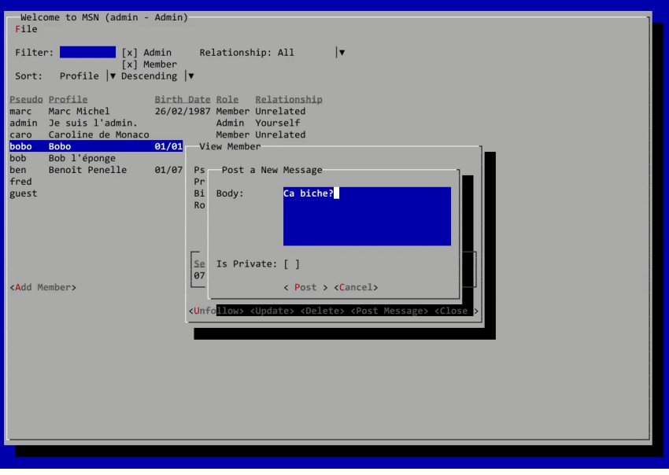

# MSN (My Social Network)

MSN is a simple console-based social network application built in **Java** following the **MVC (Model-View-Controller) architecture**.  
It is a learning project designed to demonstrate the MVC pattern in a practical way.


---

## 📌 Features

The application allows members to:

- View the list of other members and their profiles.
- Edit their own profile.
- Follow other members (tracking who follows whom).
- **Note:** Posting messages on a member’s "wall" is not implemented in this tutorial.

---

## 🗂 Project Structure
```text
MSN/
├─ README.md                  ← Project documentation
├─ src/
│   ├─ main/
│   │   ├─ java/               ← Java source code
│   │   │   └─ com/msn/...     
│   │   └─ resources/          ← Optional resources (config, etc.)
│   └─ test/
│       └─ java/               ← Unit tests
├─ sql/                        ← Optional SQL scripts
└─ pom.xml / build.gradle       ← Project build configuration
```
---

## 🛠 Technologies

- **Language:** Java
- **Architecture:** MVC (Model-View-Controller)
- **IDE:** Any Java-compatible IDE (IntelliJ, Eclipse, VS Code, etc.)

---

## 🚀 Getting Started

1. **Clone the repository:**
```bash
git clone https://github.com/your-username/MSN.git
```

2. **Navigate to the project folder:**
```bash
cd MSN
```
3. **Compile and run the applicaton**
```bash
javac -d bin src/main/java/com/msn/**/*.java
java -cp bin com.msn.Main
```